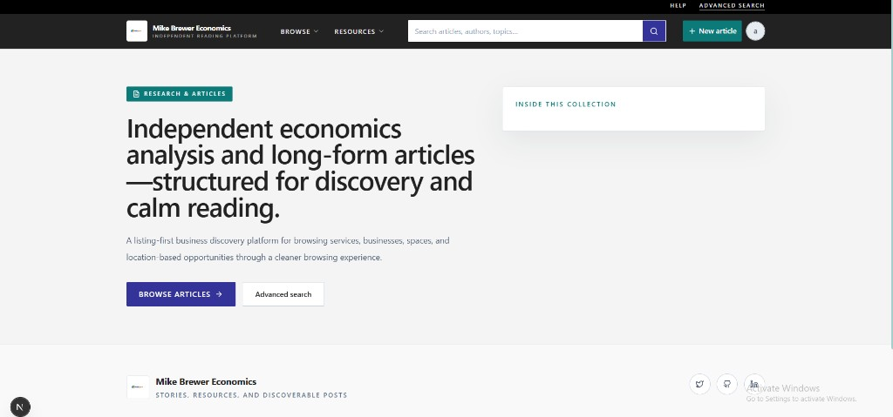
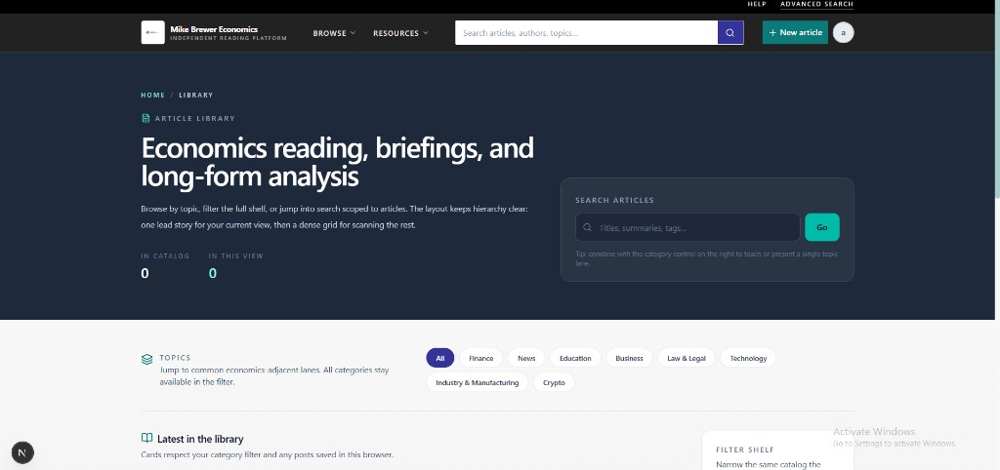
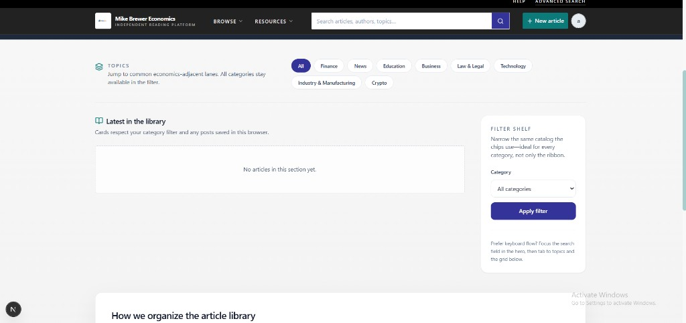
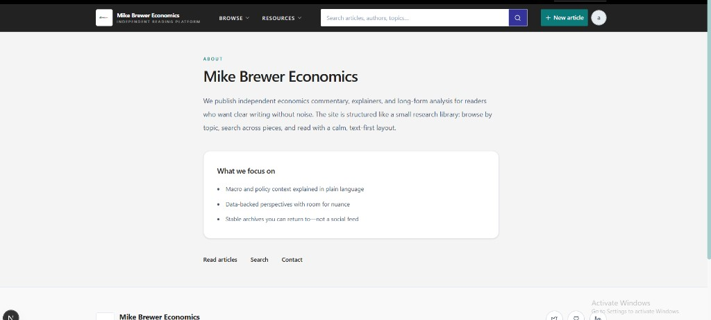
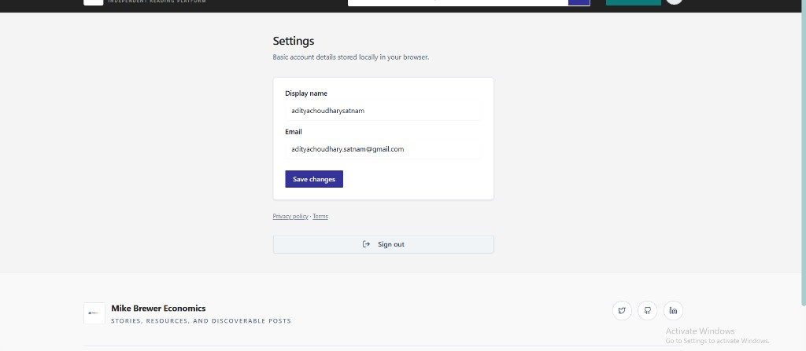

# Mike Brewer Economics

Next.js site for an independent reading platform: editorial navigation, article library, and supporting pages.

## Screenshots

Images are stored in [`docs/readme-screenshots/`](docs/readme-screenshots/) so they render inline on GitHub.

### Homepage



### Article library



### Articles — topics and grid



### About



### Settings



## Development

```bash
pnpm install
pnpm dev
```

See [`deploy/README.md`](deploy/README.md) for deployment notes if applicable.
